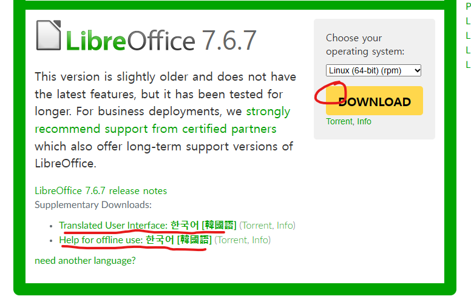
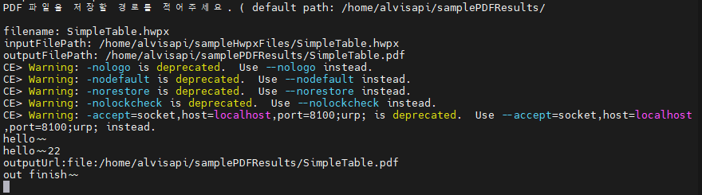

# LibreOffice를 활용하여 hwp / hwpx 파일을 pdf로 변환하는 Java Project

## 개요
HWP, HWPX 파일을 Client 환경에서 Viewer 라이브러리를 통해 보여주어야 하는데, 
자료조사 결과 JavaScript 환경에서 HWPX 관련 뷰어 라이브러리는 존재하지 않는것으로 판단하여 pdf 및 다른 확장자로 변환 후 보여주는 방향으로 결정.

한컴에서 제공하는 API가 있지만 통합 뷰어 프로그램 설치해야하고 무료가 아니라 패스하였고,
Linux계의 MS Office라 불리는 LibreOffice를 발견 및 Java SDK를 제공하는것을 확인하여 사용하기로 결정.

## 환경
- Java: java 1.8
- Maven Project

## 설명
- Scanner를 사용하여 사용자의 hwp/hwpx 파일 위치, 파일명, 다운로드할 위치를 입력받아 변환 진행하도록 구현.


## 주의할 점
- LibreOffice를 직접 설치해야 한다. (https://www.libreoffice.org/download/download-libreoffice/) ( Windows, MacOS, Linux 전부 가능)
- HWP / HWPX 파일을 인식 및 변환할 수 있도록 추가 확장 프로그램을 설치해야 한다. (  )
  - https://github.com/ebandal/H2Orestart/releases/tag/v0.6.5
  - 위의 사이트에 접속하여 "H2Orestart.oxt" 파일을 다운 받는다.
  - 그리고 LibreOffice 프로그램을 실행 후, 확장 프로그램 추가 화면에서 직접 등록해야 한다. ( CentOS 환경의 경우, 하단에 기재)
- C 드라이브나 다른 드라이브 및 다른 OS에서 설치하는 경우 -> LibreOfficeConverter.java -> officePath 변수값을 변경 해주어야 한다.

##
---

# CentOS 환경

## LibreOffice 및 한국어팩 설치 ( 현재 154 서버에 설치되어 있음. )

1. https://www.libreoffice.org/download/download-libreoffice/ 들어가서 7.6 버전의 rpm.tar.gz 파일 “Download” 버튼을 클릭하여 다운 ( 다운로드 후 CentOS → 원하는 폴더에 옮겨주기 )
2. 하단의 밑줄친 한국어팩 2개 같이 다운로드

   

3. “tar -zxvf /path/to/LibreOffice_7.6.7…rpm.tar.gz” 명령어로 압축 풀기
4. “cd LibreOffice_7.6.7…rpm/RPMS” 이동 후 “yum localinstall *.rpm” 실행하여 설치
5. 한국어팩 설치도 3, 4번과 동일하게 진행.

---

## LibreOffice에서 HWP/HWPX파일 인식하기 위한 확장 프로그램 설치

1. https://extensions.libreoffice.org/en/extensions/show/27504 로 접속하여 “H2Orestart-0.6.5.oxt” 파일을 다운로드. ( 설치 후 CentOS → 원하는 폴더에 옮기기 )
2. 아래 명령어에서 /path/to 부근만 파일 옮긴 폴더 위치로 바꾼 후 → 명령어 실행.

    ```bash
    # CentOS
    /opt/libreoffice7.6/program/unopkg add --shared /path/to/H2Orestart-0.6.5.oxt
    ```


---

## 리눅스 환경에서 한글 파일 폰트 인식을 위한 나눔 폰트 설치

1. https://blog.naver.com/unsutilizer/221069303648 참고하여 설치

```bash
# 1.
wget http://cdn.naver.com/naver/NanumFont/fontfiles/NanumFont_TTF_ALL.zip

# 2.
sudo unzip NanumFont_TTF_ALL.zip -d /usr/share/fonts/nanum

# 예외 ( 만약 nanum 폴더가 없어 에러가 나는 경우 )
mkdir -d /usr/share/fonts/nanum
```

> HWP 파일을 PDF로 변환하는 과정에서 다른 사람도 에러가 났었는데,
해당 확장 프로그램을 개발하신분이 답한 내용중에, “fonts-nanum*” 명령어를 통해 한글 폰트를 설치하여 해결할 수 있다고 나와있다.

https://github.com/ebandal/H2Orestart/issues/11#issuecomment-1642053121
>

---

## HWPX/HWP → PDF 변환 명령어

```bash
libreoffice7.6 --headless --infilter="Hwp2002_File" --convert-to pdf:writer_pdf_Export "/path/to/[filename].[hwpx or hwp]" --outdir "/save/path" -env:SingleAppInstance=false
```

- libreoffice7.6 ⇒ libreoffice cli 실행 명령어로, 뒤에 “7.6”은 설치한 버전에 맞춰 변경하면 된다.
- --headless ⇒ gui 없이 실행
- --outdir ⇒ 변환될 파일이 저장될 폴더 위치
- SingleAppInstance=false ⇒ 싱글이 아닌 멀티환경으로 실행될 수 있도록 설정하는 속성값

## LibreOffice에서 제공하는 SDK를 활용해, Java Project에서 테스트

```bash
# libreoffice sdk test project 실행 명령어 
# 154 서버로 접속.
# ( Scanner 클래스를 활용해, HWPX 폴더 위치, 파일명, PDF 저장 위치를 받을 수 있도록 구현 )
# ( SDK를 사용할 경우 HWP 파일에 대한 처리, 없는 파일을 고를 경우에 대한 처리는 아직 미구현 )
java -jar /home/alvisapi/LibreOfficeTest/libreOfficeTest.jar

```


